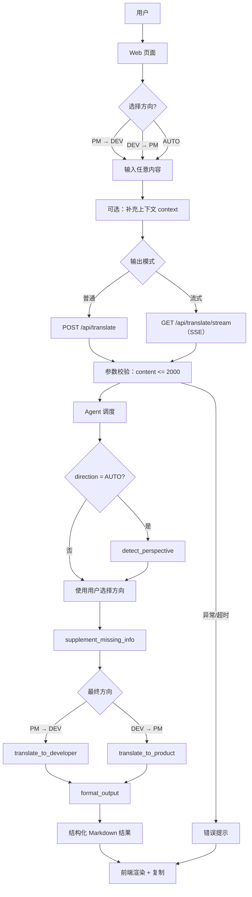

# 职能沟通翻译助手（agents-translate）

**线上地址：** [translate.rowlandw3ai.shop](https://translate.rowlandw3ai.shop)

在企业协作中，产品经理（PM）与开发工程师（DEV）常因表达视角不同而产生理解偏差。本项目旨在通过大模型将两类输入进行”双向翻译”，让需求与技术结论都能以对方更容易理解、可直接使用的结构化方式呈现。

## 核心能力

- PM → DEV：把业务需求翻译为可落地的技术描述（方案、数据、性能、工作量、待确认点）
- DEV → PM：把技术方案/技术结论翻译为业务语言（体验影响、业务价值、增长空间、风险提示）
- 结构化输出：以 Markdown 分段输出，便于复制与复用
- 流式输出（规划）：通过 SSE 边生成边展示
- 自动识别输入视角（规划）：不选方向时自动判断并选择翻译路径
- 主动补全缺失信息（规划）：在结果中标注缺失点并给出追问建议

## 使用说明流程图



## 仓库状态

- 当前包含：需求/技术设计文档、NestJS 后端骨架（`apps/api`）
- 待补齐：TranslateController/TranslateService、LangChain Agent/Tools、前端 Web 应用（详见技术文档中的目录结构与模块设计）

## 快速开始（当前可运行的后端骨架）

### 环境要求

- Node.js >= 20
- pnpm（建议 >= 9）

### 安装依赖

```bash
pnpm install
```

### 启动

```bash
pnpm dev
```

或仅启动后端：

```bash
pnpm --filter api dev
```

默认监听 `http://localhost:3000`，并设置了全局前缀 `/api`，因此基础访问地址为：`http://localhost:3000/api`。

## 环境变量

后端支持通过环境变量配置端口与 CORS：

```bash
# apps/api/.env
PORT=3000
CORS_ORIGIN=http://localhost:3721
```

大模型相关环境变量在完整翻译链路实现后使用（设计如下）：

```bash
# 大模型提供商（anthropic | openai）
LLM_PROVIDER=anthropic

# Anthropic
ANTHROPIC_API_KEY=sk-ant-xxxxx
ANTHROPIC_MODEL=claude-sonnet-4-6

# OpenAI（备选）
OPENAI_API_KEY=sk-xxxxx
OPENAI_MODEL=gpt-4o
```

## API 设计（按技术文档规划）

### POST /api/translate

Request：

```json
{
  "content": "我们需要一个智能推荐功能...",
  "direction": "PM_TO_DEV",
  "context": "电商平台"
}
```

Response：

```json
{
  "result": "## 技术实现方案\n...",
  "direction": "PM_TO_DEV",
  "detectedPerspective": "PM",
  "missingInfo": ["冷启动用户策略", "推荐内容过滤规则"]
}
```

### GET /api/translate/stream（SSE）

Query Params：`content`, `direction`, `context`

SSE Event（示意）：

```
data: {"token":"##"}
data: {"token":" 技术实现方案"}
data: {"done":true,"missingInfo":[...]}
```

## 测试用例（示例）

### 用例 1：PM → DEV

输入：

> 我们需要一个智能推荐功能，提升用户停留时长。推荐用户可能感兴趣的内容，要求个性化，响应要快。

期望输出包含（示例维度）：

- 推荐的技术实现方案（算法/架构/取舍）
- 数据来源与处理方式
- 性能与实时性要求（如 P99 指标、离线/实时策略）
- 工作量预估（T 恤尺码或工作日）
- 缺失信息与待确认决策点（如冷启动、已读过滤）

### 用例 2：DEV → PM

输入：

> 我们优化了数据库查询，增加了复合索引，QPS 从 1000 提升到 1300，P99 延迟从 800ms 降至 200ms。

期望输出包含（示例维度）：

- 用户体验影响（更快、更稳定，以数字/类比解释）
- 业务价值（承载能力提升、成本节省等）
- 增长潜力（可支持更高并发/更大促销活动等）
- 风险与注意事项（例如仍需压测、回滚方案等）

## 提示词设计要点（摘要）

- 角色切换：通过 System/Instruction 让模型以“资深架构师”或“产品总监”的视角输出
- 结构约束：强制 Markdown 分段与列表，避免纯叙述段落
- 补全缺失信息：先识别输入完整度，输出追问列表/合理默认假设
- 自动路由（可选）：未选择方向时先识别输入来自 PM 还是 DEV，再选择翻译工具链

## 文档索引

- 需求文档：`.ai/docs/requirements.md`
- 技术文档：`.ai/docs/technical.md`
- Skills/提示词模板：`.ai/skills/skills.md`
- 题目说明：`docs/[AI编程题]Agent-简化版.md`
