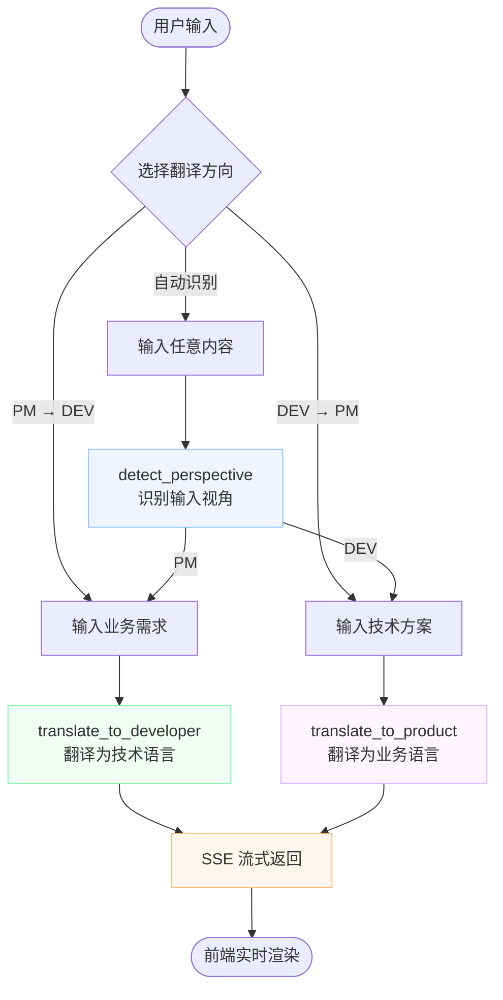

# 职能沟通翻译助手（agents-translate）

**线上地址：** [communicate.singulay.online](https://communicate.singulay.online/)

在企业协作中，产品经理（PM）与开发工程师（DEV）常因表达视角不同而产生理解偏差。本项目通过 AI 大模型实现双向翻译，让需求与技术方案都能以对方能直接使用的结构化语言呈现。

## 核心能力

- **PM → DEV**：把业务需求翻译为可落地的技术描述（方案、性能要求、工作量、待确认点）
- **DEV → PM**：把技术方案/结论翻译为业务语言（体验影响、业务价值、风险提示）
- **自动识别**：不选方向时自动判断输入来自 PM 还是 DEV，选择翻译路径
- **流式输出**：通过 SSE 边生成边展示，首字延迟 < 2s
- **会话隔离**：三个方向各维护独立输入/输出，切换后内容保留

## 使用说明



## 快速开始

### 环境要求

- Node.js >= 20
- pnpm >= 9

### 安装

```bash
pnpm install
```

### 配置

编辑 `apps/api/.env`：

```bash
OPENAI_API_KEY=sk-xxxxxxxxxxxxxxxx  # 必填
OPENAI_MODEL=gpt-4o                 # 可选，默认 gpt-4o
PORT=3000
CORS_ORIGIN=http://localhost:3721
```

### 启动

```bash
pnpm dev
# 前端 http://localhost:3721
# 后端 http://localhost:3000
```

## API

### POST /api/translate

```json
// Request
{ "content": "我们需要一个智能推荐功能", "direction": "PM_TO_DEV" }

// Response
{ "result": "**一句话总结：** ...\n\n**更多详细信息：** ..." }
```

### GET /api/translate/stream（SSE）

Query Params：`content`, `direction`, `context`

```text
data: {"token": "**一句话"}
data: {"token": "总结：**"}
data: {"done": true}
```

## 部署方案

### 架构

```text
Cloudflare Pages (前端)  →  Cloudflare Workers (后端 API)  →  OpenAI API
```

| 服务     | 平台               | 地址                                                                |
| -------- | ------------------ | ------------------------------------------------------------------- |
| 前端     | Cloudflare Pages   | [communicate.singulay.online](https://communicate.singulay.online/) |
| 后端 API | Cloudflare Workers | agents-translate-api.rowlandw3ai.shop                               |

### 部署前端（Cloudflare Pages）

```bash
# 构建
pnpm --filter web build

# 部署
cd apps/api && pnpm wrangler pages deploy ../web/dist --project-name agents-translate --branch main
```

### 部署后端（Cloudflare Workers）

```bash
cd apps/api

# 首次：登录 & 设置密钥
pnpm wrangler login
pnpm wrangler secret put OPENAI_API_KEY

# 部署
pnpm wrangler deploy
```

### 环境变量

Workers 通过 `wrangler secret` 管理敏感配置，非敏感配置写在 `wrangler.toml`：

```toml
# apps/api/wrangler.toml
[vars]
OPENAI_MODEL = "gpt-4o"
```

```bash
# 以 secret 形式存储（不入代码）
pnpm wrangler secret put OPENAI_API_KEY
```

## AI 工具与模型选型

### 大模型：OpenAI GPT-4o

选择 GPT-4o 而非其他模型的理由：

- **中文理解质量**：GPT-4o 在中文语境下的角色扮演和结构化输出稳定性优于同价位竞品
- **流式响应**：原生支持 streaming，与 SSE 方案配合无额外延迟
- **成本平衡**：相比 GPT-4o-mini 输出质量明显更高；相比 o1/o3 系列无需 reasoning token，翻译场景不需要长链推理，cost 更低
- **API 稳定性**：OpenAI API 在 Cloudflare Workers 的 `nodejs_compat` 模式下兼容性最佳

### Agent 框架：LangChain.js

选择 LangChain.js 而非直接调用 SDK 的理由：

- **边缘兼容**：`@langchain/openai` 支持 Cloudflare Workers 等非 Node.js 运行时，无需额外适配
- **流式抽象**：统一的 `stream()` 接口屏蔽了不同 LLM provider 的差异，未来切换模型只改环境变量
- **Tool 规范**：`DynamicStructuredTool` + Zod schema 提供类型安全的工具定义，与 Skills 文档天然对应

### HTTP 框架：Hono（Workers 部署）+ NestJS（本地开发）

- **Hono**：专为 Cloudflare Workers 设计，bundle size < 20KB，原生支持 `streamSSE`；NestJS 依赖 Node.js http server 无法直接运行在 Workers 上
- **NestJS**：本地开发保留，模块化架构便于团队协作，`nest start --watch` 热重载体验好
- **双入口策略**：`src/main.ts`（NestJS，本地）和 `src/worker.ts`（Hono，生产）共享同一套业务逻辑（`AgentCore`），互不干扰

### 前端构建：Vite + React

- Vite 产物为纯静态文件，与 Cloudflare Pages 零配置兼容
- `_redirects` 文件处理 SPA 路由回退，无需额外 Pages Functions

## 提示词设计要点

- **角色切换**：System Prompt 让模型以"资深架构师"或"产品总监"视角输出，强化角色认知
- **格式约束**：强制"一句话总结 + 更多详细信息"的两段式结构，控制输出长度（200字以内）
- **解耦维护**：Prompt 模板独立存放于 `src/prompts/`，修改提示词不触发代码变更
- **自动路由**：AUTO 方向时先调用 `detect_perspective` 判断视角，再路由到对应翻译函数

## 文档索引

- 需求文档：[`.ai/docs/requirements.md`](.ai/docs/requirements.md)
- 技术文档：[`.ai/docs/technical.md`](.ai/docs/technical.md)
- Skills 定义：[`.ai/skills/skills.md`](.ai/skills/skills.md)
- 题目说明：[`docs/[AI编程题]Agent-简化版.md`](docs/[AI编程题]Agent-简化版.md)
